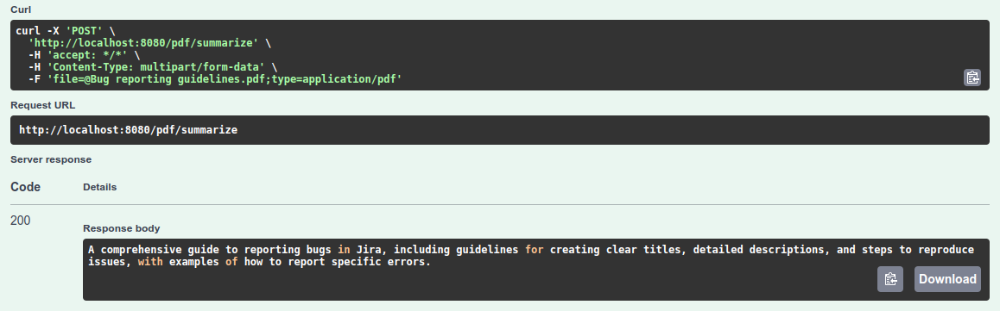
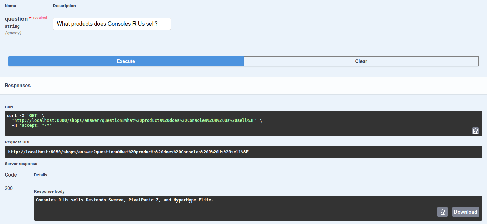

# Spring Boot AI Proof of Concept

This project is a proof-of-concept for using Spring Boot AI.

It uses `llama3.1:8b` as the backing LLM.

## Functionality

## PDF summarization

The application can be asked to describe the contents of PDF documents.



## Answering questions about shops (LLM calling Java functions)

As an example of LLMs interacting with Java code, the application can be asked questions about shops stored
in a `ShopRepository`.

Given a question like `What products does Consoles R Us sell?`, the LLM knows to use `shopRepository.findByName`
to find all products sold by *Consoles R Us*.



## Prerequisites

The AI model needs a lot of RAM, so make sure to close any unnecessary applications.

You will also need an additional ~6GB to download the dependencies (mainly the LLM model).

## Getting started

You can start the application using the following command:

```shell
mvn spring-boot:run
```

All necessary dependencies will automatically start with the application in the form of Dockerized containers.

The first start will take a very long time, due to having to download the AI model.

Once the application starts, all endpoints will become available at
[http://localhost:8080/swagger-ui/index.html](http://localhost:8080/swagger-ui/index.html).

Bear in mind that it can take a very long time for the LLM to generate a response.

[Open WebUI](https://github.com/open-webui/open-webui) is included as an additional dependency and is available
at [http://localhost:8089] to allow direct prompting of the underlying LLM for debugging purposes.

## Shortcomings

### Tool infancy

AI tools are still young and may produce problems due to that. 
An example is the LLM cutting off parts of the document due to the context size not being large enough, while only
logging a `WARN`, making it almost impossible to notice without looking through LLM logs.

### Resource intensiveness

An LLM is incredibly resource-intensive, and generating a response on a laptop takes ~5 minutes (with a local LLM).
While using a GPU would undoubtedly speed up the process, many existing servers don't have powerful GPUs. 
Using cloud AI providers is unlikely to be much more cost-effective, especially once providers like OpenAI stop
subsidizing their costs.

This suggests that implementing AI features is not practical for any but the most innovative and useful features.
For any use case, non-AI solutions should be considered first, as they are likely to be more cost-effective. 

### Leaky abstraction

While the LLM is abstracted behind things like the `ChatModel` interface, a given prompt can produce different results
depending on the AI model underneath. 
Therefore, changing the AI model may require tweaking the prompts.

### Document size limit

The size of the document, after converting it to simple text, cannot exceed the maximum context size which
the AI model supports (128k tokens for Llama 3 8B), minus the size of the system prompt.

### Images can't be interpreted

The currently used LLM is not multimodal and therefore can only process text.
To enable image processing, a model like [LLaVa](https://llava-vl.github.io/) would have to be used.

### Low intelligence

The model used is not intelligent enough to answer complex questions.
An example is when it's provided with two functions alongside the prompt:
one to list the names of available shops, and another to retrieve the details of a shop by name. 
It is unable to infer that it should use both of them in a specific way to come up with an answer.
Using the prompt for gentle coaxing towards the solution doesn't seem to help.
At best, it runs the queries with garbage data.
At worst, it tries to call functions that don't exist.

While bigger models may fare better at this task, this drives up the maintenance cost considerably.

### Hallucinations

The current generation of LLMs is prone to hallucinations and therefore the generated summaries cannot be trusted
in a context where their accuracy is paramount.

A relatively tame example of misinterpretation which I came across is the LLM insisting that no information
about education was provided in the document, when fed a CV where this information was displayed prominently.

Another example is when the LLM tried calling a Java function that does not exist, leading to a runtime exception.

### Garbage responses

Due to the unpredictable nature of LLMs, the response could potentially be garbage.
Therefore, care should be made when handling AI responses.
This is different from hallucinations, as the LLM may decide to follow an entirely different response structure,
in addition to making up facts.

### Jailbreaking is a risk

Any LLM could possibly be jailbroken. 
In this case, a PDF could be prepared with content telling the LLM to ignore previous instructions.
If the LLM knows about sensitive information, it could be made to leak those.
Therefore, it's important to make sure it only knows about information that would not be harmful
if exposed in a response.

### Language limitations

The languages supported and the quality of that support will be limited by the LLM being used.
In the case of Ollama, it should be assumed that English documents have the highest chance of being interpreted
correctly.

## Ideas for improvement

The LLM used is a general-purpose LLM.
A version tuned specifically for interpreting documents might yield better results.

## TODO

- Consider using `llama3.3:3B`
- The controller should only accept PDF documents
- Add tests
- Make Ollama health check wait until a model is pulled
- Ollama `entrypoint.sh` should wait for Ollama to start instead of sleeping 5 seconds
- Document size limit should not be allowed to exceed what the LLM can interpret